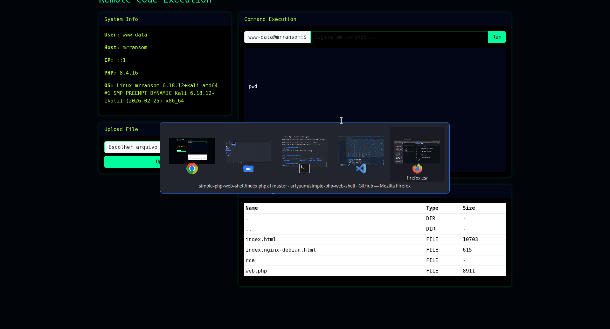

# RCE WebShell (PHP)

Painel de **Remote Code Execution (RCE)** desenvolvido em PHP com interface estilo terminal para fins educacionais.

Este projeto foi criado para **estudos de segurança ofensiva**, **CTFs** e **laboratórios de pentesting**, permitindo executar comandos remotos em um servidor através de uma interface web.

⚠️ **Aviso:**
Este projeto deve ser utilizado **apenas em ambientes autorizados**, como laboratórios locais ou plataformas de CTF.

---

## Demo



---

## Features

* Execução remota de comandos
* Painel de informações do sistema
* File Manager
* Upload de arquivos
* Interface estilo terminal (hacker theme)
* Saída de comandos formatada

---

## Tecnologias utilizadas

* PHP
* Bootstrap 5
* HTML5
* CSS

---

## Instalação

Clone o repositório:

```bash
git clone https://github.com/rckdemezio/rce-webshell-php.git
```

Copie o arquivo para o diretório do Apache ou um diretório de sua preferência para envio via FTP ou SSH. No meu caso to mostrando o envio para o meu ambiente local apache.

```bash
sudo cp web.php /var/www/html/
```

Acesse no navegador:

```
http://localhost/web.php
```

---

## Uso educacional

Ferramenta destinada ao estudo de:

* Remote Command Execution (RCE)
* Web exploitation
* Pentesting
* Capture The Flag (CTF)

---

## Estrutura do projeto

```
rce-webshell-php
│
├─ demo
│  └─ demo.gif
│
├─ web.php
│
└─ README.md
```

---

## Autor

Henrique Demezio

---

## Disclaimer

Este projeto foi criado **exclusivamente para fins educacionais**.
O autor não se responsabiliza por qualquer uso indevido desta ferramenta.
